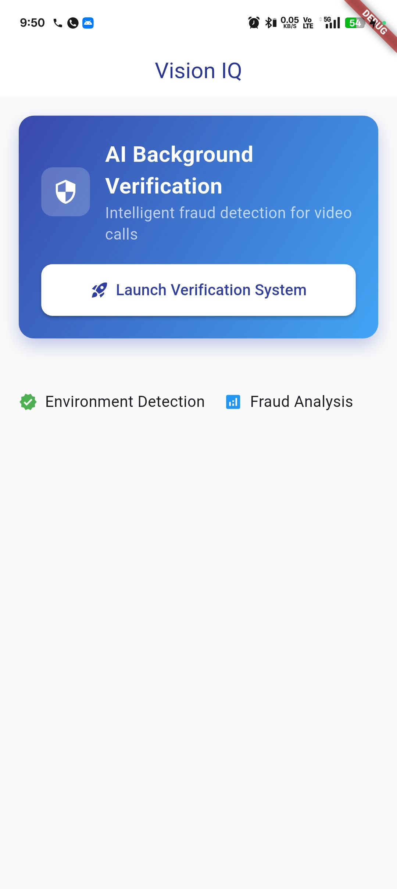
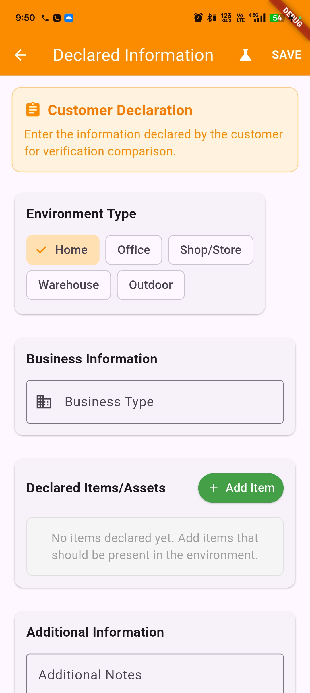

# 🔍 Vision IQ - Smart Background Verification

An AI-powered mobile app that detects fraud in video calls by analyzing backgrounds and environments using advanced computer vision.

## 📱 What Does This App Do?

Vision IQ helps businesses verify if customers are calling from their claimed locations. Perfect for:
- **Banking & Finance**: Verify loan applicants' declared addresses
- **Insurance**: Confirm claim authenticity by location verification
- **Remote KYC**: Ensure customer identity verification accuracy
- **Security Services**: Detect suspicious backgrounds in video calls

## 🎯 How It Works

1. **📋 Declare Information**: Customer states their environment (home, office, etc.)
2. **📸 Capture**: Take a photo or video during the call
3. **🤖 AI Analysis**: Our AI analyzes the background automatically
4. **⚠️ Risk Assessment**: Get instant fraud risk scores and recommendations

## ✨ Key Features

- ✅ **Instant Analysis**: Real-time background verification
- 🧠 **AI-Powered**: Uses Google's advanced Gemini AI model
- 📊 **Risk Scoring**: Clear low/medium/high/critical risk levels
- 🎥 **Video Support**: Analyze both images and videos
- 📱 **Mobile-First**: Optimized for smartphones and tablets
- 🚀 **Demo Mode**: Try it out with sample data

## 📸 Screenshots

  
*Main dashboard with easy access to verification features*

  
*Clean interface for setting up and running analysis*

  
*Detailed risk assessment with clear recommendations*

  
*Try the app with pre-loaded sample scenarios*

  
*User-friendly form to enter declared environment details*

  
*Frame-by-frame AI-powered video background verification*

  
*Color-coded risk levels for easy interpretation*

  
*Manage app settings, permissions, and preferences*


## 🚀 Quick Start

### For Users
1. Download and install the app
2. Open Vision IQ
3. Tap "Background Verification"
4. Set your declared environment
5. Take a photo or video
6. Get instant results!

### For Developers

```bash
# Clone the project
git clone <your-repo-url>
cd vision_iq_project

# Install dependencies
flutter pub get

# Run the app
flutter run
